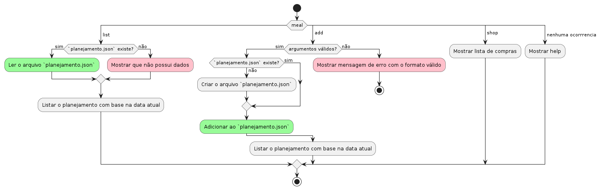

	

# Meal
**Gerenciador de refeições CLI Esta em desenvolvimento!**

[Porque usar](#porque-usar) -
[Como usar](#como-usar) -
[Quando usar](#quando-usar) -
[Aonde usar](#aonde-usar) -
[Testado](#testado)

## Pré-visualização

## Porque usar
-

## Como usar
1. Clone o repositório
    - `git clone https://github.com/renatonunes74/meal`
1. Entre na pasta
    - `cd meal`
1. Execute 
    - CLI / via Terminal:
        - `chmod +x meal.sh` (Para deixar executável)
        - `./meal.sh -h` (Para listar todas as funções)
1. Agora é só adicionar receitas, estoque e listar!

### Dependências necessárias
- Pacotes Linux básicos, como: cat, grep, find, sed...

### Funcionalidades
#### Básico
- [ ] Adicionar refeições para os dias "planejados"
	- `meal add "nome da refeição" 2023-07-23`
- [ ] Mostrar o que devo preparar hoje e "link para a receita""
	- `meal list`
- [ ] Lista de compras com base nas receitas planejadas
---
#### Avançado
- [ ] Mostrar a quantidade de carboidratos, proteínas etc
- [ ] Comparar lista de compras com estoque
	- Integrar com o `hledger`
- [ ] Adicionar formas mais rápidas de adicionar várias refeições

##### Planejamento

### Tecnologias usadas
- FZF
- Jq
- Complementares:
     <!-- - [VHS](https://github.com/charmbracelet/vhs) (Criação de GIF do terminal via código) -->

## Quando usar
- Quando necessitar documentar, verificar ou até mesmo demonstrar o relacionamento das classes.

## Aonde usar
- Via terminal que suporte SHELL Script e as ferramentas ([Dependências necessárias](#dependências-necessárias))

## Testado
- 

## Contribuição
Estou aberto a contribuições, feedback e opiniões da comunidade! Se você tiver alguma ideia para melhorar o projeto, correções de bugs ou sugestões de novos recursos, ficarei feliz em receber sua contribuição! Basta enviar um Pull Request no repositório do projeto.
