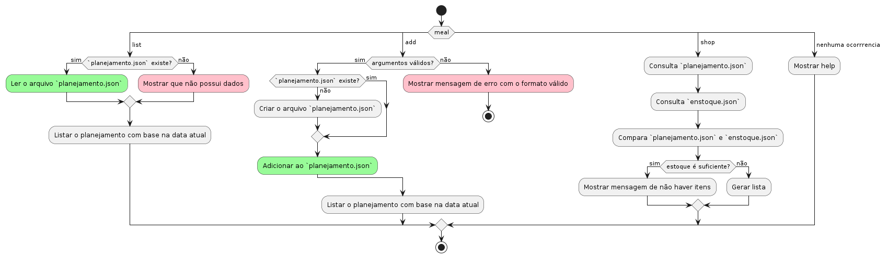

	

# Meal
**Gerenciador de refeições usando Dialog Esta em desenvolvimento!**

[Porque usar](#porque-usar) -
[Como usar](#como-usar) -
[Quando usar](#quando-usar) -
[Aonde usar](#aonde-usar) -
[Testado](#testado)

## Pré-visualização

## Porque usar
-

## Como usar
1. Clone o repositório
    - `git clone https://github.com/renatonunes74/meal`
2. Entre na pasta
    - `cd meal`
    - Edite os arquivos de `planejamento.json` e `receitas.json` com base em sua estrutura
3. Execute 
    - CLI / via Terminal:
        - `chmod +x meal.sh` (Para deixar executável)
        - `./meal.sh` 
4. Agora é só adicionar receitas, estoque e listar!

### Dependências necessárias
- [FZF](https://github.com/junegunn/fzf) (Fuzzy finder)
- [Jq](https://github.com/jqlang/jq) (Manipulação de dados no formato JSON)

### Funcionalidades
#### Básico
- [x] Adicionar refeições para os dias "planejados"
- [x] Mostrar o que devo preparar hoje
- [ ] Lista de compras com base nas receitas planejadas
---
#### Avançado
- [ ] Mostrar a quantidade de carboidratos, proteínas etc
- [ ] Comparar lista de compras com estoque
	- Integrar com o `hledger`
- [ ] Adicionar formas mais rápidas de adicionar várias refeições

##### Planejamento

### Tecnologias complementares
- Complementares:
     - [VHS](https://github.com/charmbracelet/vhs) (Criação de GIF do terminal via código)

## Quando usar
- Quando necessitar documentar, verificar ou até mesmo demonstrar o relacionamento das classes.

## Aonde usar
- Via terminal que suporte SHELL Script e as ferramentas ([Dependências necessárias](#dependências-necessárias))

## Contribuição
Estou aberto a contribuições, feedback e opiniões da comunidade! Se você tiver alguma ideia para melhorar o projeto, correções de bugs ou sugestões de novos recursos, ficarei feliz em receber sua contribuição! Basta enviar um Pull Request no repositório do projeto.
